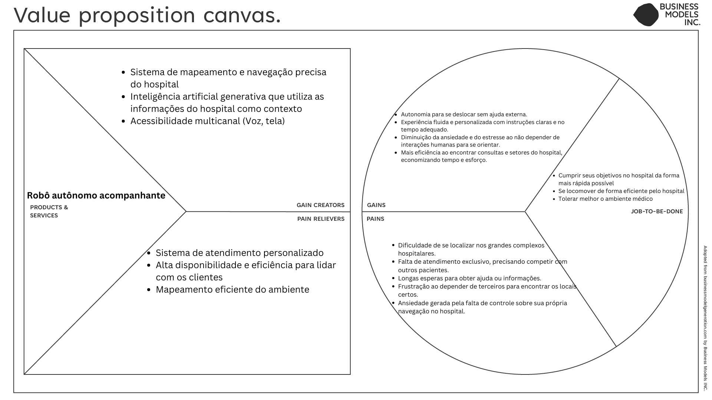
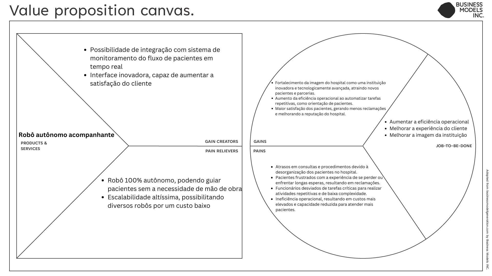

# Análise Financeira: Viabilidade Econômica do Projeto Grupo-03

## Introdução

&emsp;A análise financeira deste projeto visa avaliar a viabilidade econômica da implementação do robô autônomo em ambientes de saúde, com foco em hospitais. O robô tem como função principal o transporte de amostras entre setores do hospital, automatizando parte do processo logístico. Ao permitir que profissionais de saúde dediquem mais tempo ao atendimento dos pacientes, o robô pode reduzir custos operacionais e aumentar a eficiência do hospital.

&emsp;Nesta seção, serão abordados os custos envolvidos no desenvolvimento e implementação do protótipo, bem como as projeções de custo-benefício para a solução final em larga escala. Consideraremos também os custos de manutenção, suporte técnico e possíveis atualizações do sistema ao longo de seu ciclo de vida. A análise financeira será essencial para identificar o retorno sobre o investimento (ROI), justificando a aplicação dessa tecnologia inovadora nos hospitais.

## Value Proposition Canvas: Como iremos gerar valor para o projeto?

&emsp;Foram desenvolvidos dois Value Proposition Canvas (VPC) para este projeto, cada um focando em diferentes stakeholders envolvidos no processo. O primeiro VPC foi criado com foco no paciente, o cliente final atendido pelo robô autônomo. Ele descreve como o robô proporciona uma experiência personalizada e eficiente de orientação dentro do hospital, aliviando dores comuns que pacientes enfrentam, como a desorientação e a necessidade de interações humanas repetitivas.

&emsp;O segundo VPC, por outro lado, foca na perspectiva do hospital como instituição. Ele explora os benefícios operacionais que o robô oferece ao hospital, como a redução de custos operacionais, melhoria na eficiência dos atendimentos e otimização da experiência geral dos pacientes, resultando em uma reputação fortalecida e maior capacidade de atender mais pessoas com menos sobrecarga de equipe.

&emsp;Cada VPC foca em como o robô oferece soluções para dores específicas e gera ganhos tanto para os pacientes quanto para o hospital, fornecendo uma visão mais abrangente do impacto que a solução trará ao ser implementada.

  
  

  
<b>Fonte:</b> Elaborado por Grupo-03

  

  
<b>Fonte:</b> Elaborado por Grupo-03

>Nota: Não avaliamos e nem consideramos todo o VPC, apenas dois fatores que estão descritos abaixo que consideramos crucial serem explorados.

### Fator I --> Escalabilidade

&emsp;Como evidenciado pela análise financeira a seguir, o principal custo do protótipo se trata principalmente do desenvolvimento dele. Uma vez desenvolvido e implementado, o custo marginal para utilizar novos robôs é significativamente baixo em comparação com os ganhos que o hospital obtém. 

&emsp;Com o uso de múltiplos robôs, é diminuida cada vez mais a necessidade de que funcionários sejam designados para essas tarefas repetitivas. Isso gera uma economia operacional significativa ao longo do tempo, permitindo que o hospital alivie cada vez mais a carga de trabalho da equipe. Com a expansão do uso desses robôs, a instituição pode manter sua eficiência e aumentar a qualidade do atendimento sem ter custos adicionais expressivos ou necessidade de mudanças estruturais significativas.

### Fator II --> Melhora da Experiência do Paciente

&emsp;Além dos benefícios operacionais para o hospital, a introdução do robô autônomo traz uma melhora significativa na experiência do paciente. Ao ser orientado por uma tecnologia precisa e eficiente, o paciente tem uma navegação mais fácil e menos estressante dentro das instalações hospitalares. Isso reduz o tempo de espera e as chances de desorientação, garantindo que o paciente receba um atendimento mais ágil e humanizado.

&emsp;A tecnologia também contribui para que os profissionais de saúde possam dedicar mais tempo ao atendimento clínico, uma vez que tarefas logísticas são automatizadas. A melhoria na experiência do paciente, com um foco em conforto e agilidade, também impacta positivamente na percepção de qualidade do hospital, aumentando a satisfação e o retorno desses pacientes.

## Análise Financeira: Protótipo (Poc)

&emsp;Iremos considerar um período de 2 meses para realizar o protótipo, dividindo os custos entre os **desenvolvedores**, o custo da **infraestrutura** para manter a solução na nuvem (cloud) e o custo do **hardware** que utilizaremos para testar nossa tese (Poc). Portanto, as pesquisas e o cálculo relacionados aos investimentos será levando em consideração em cima desse tempo.

### Desenvolvimento de Software: Custo médio da mão de obra

| Função                 | Quantidade | Meses | Salário Mensal | Valor Final    | Fonte                |
| ---------------------  | ---------- | ----- | -------------- | -------------- | -------------------- |
| Engenheiro de Software | 1          | 2     | R$ 6.303,00    | R$ 12.606,00   | [VAGAS](https://www.vagas.com.br/cargo/engenheiro-de-software#:~:text=No%20cargo%20de%20Engenheiro%20de,de%20R%24%206.303%2C00.) |
| Engenheiro Robótico	 | 2          | 2     | R$ 8.991,71    | R$ 35.966,84   | [QueroBolsa](https://querobolsa.com.br/carreiras-e-profissoes/engenheiro-robotico)
| Engenheiro de DevOps   | 1          | 2     | R$ 9.000,00       | R$ 18.000,00      | [GLASSDOR](https://www.glassdoor.com.br/Sal%C3%A1rios/devops-engineer-sal%C3%A1rio-SRCH_KO0,15.htm) |
| Gestor de Projetos     | 1          | 2     | R$ 4.742,00    | R$ 9.484,00   | [VAGAS](https://www.vagas.com.br/cargo/gestao-de-projetos) |
| **Total**              |            |       |                | **R$ 88.662,84** |                    |

>Nota: Ao clicar no nome dos sites na coluna "**Fontes**", onde pesquisamos, você será redirecionado diretamente para visualizar os dados da média salarial de cada profissão em questão.

>Data da pesquisa: 21/10/2024

### Custos do hardware (Robô)

| Descrição              | Quantidade | Importado              | Valor Unitário | Valor Final          | Fonte                                                                 |
| ---------------------  | ---------- | ---------------------- | -------------- | -------------------- | --------------------------------------------------------------------- |
| Bateria de Polímero de Lítio (Li-Po) de 1800mAh | 1    | Não            | R$ 37,42    | R$ 107,55   | [AliExpress](https://pt.aliexpress.com/item/1005006948637447.html)      |
| Bateria Reserva de Polímero de Lítio (Li-Po) de 2200mAh | 1          | Não     | R$ 34,43 | R$ 118,73   | [AliExpress](https://pt.aliexpress.com/item/1005005644863300.html) |
| Robô Turtlebot 3 - Raspberry Pi 4 4GB | 1          | Sim     | R$ 6.544,75       | R$ 12.616,41     | [AliExpress](https://pt.aliexpress.com/item/1005004405764315.html)     |
| **Total**              |            |       |                | **R$ 12.842,69** |                    |

>Nota: Ao clicar no nome das lojas na coluna "**Fontes**", onde pesquisamos, você será redirecionado diretamente para o produto em questão.

>Data da pesquisa: 22/10/2024

:::warning

A coluna “**Valor Final**” inclui valores de frete e impostos de importação.

`OBS:` O imposto nacional que é cobrado nas plataformas pode variar entre 15% e 22%, entretanto, já está incluso no valor final apresentado na tabela acima. O cálculo já é feito na própria plataforma ao fechar a compra.
:::

### Custos da infraestrutura na nuvem (Cloud)

&emsp;Para estimar os custos da infraestrutura em nuvem para o protótipo inicial, pesquisamos e consideramos os seguintes aspectos pensando em um escopo de 2 meses:

| Serviço                | Quantidade | Valor/Mês   | Valor Final | 
| ---------------------  | ---------- | ----- | -------------- | 
| Computação             | 2 instâncias de máquinas virtuais com 4 vCPUs e 16 GB de RAM | R$ 0,50 por hora x 2 instâncias x 160 horas = R$ 1.600,00 | R$ 3.200,00 | 
| Armazenamento          | 500 GB de armazenamento em SSD | R$ 0,25 por GB x 500 GB = R$ 125,00 | R$ 250,00 | 
| Rede                   | 1 TB de transferência de dados | R$ 0,10 por GB x 1.024 GB = R$ 102,40 |  R$ 204,80 |
| Monitoramento e Logs   | Cloud Watch | R$ 200,00 | R$ 400,00    | 
| Banco de Dados         | 200 GB de banco de dados relacional | R$ 500,00 | R$ 1.000,00 | 
| Watson Assistant       | 50.000 interações por mês | R$ 0,02 por interação | R$ 2.000,00 |
| **Total**              |            |       | **R$ 7.054,80**  |  

>Nota I: As fontes da pesquisa feita para o custo de infraestrutura foram feitas a partir da calculadora de preços de três empresas que oferecem o melhor preço no mercado: [Google Cloud](https://cloud.google.com/products/calculator/?utm_source=google&utm_medium=cpc&utm_campaign=latam-BR-all-pt-dr-BKWS-all-all-trial-p-dr-1707800-LUAC0014411&utm_content=text-ad-none-any-DEV_c-CRE_534950712418-ADGP_Hybrid+%7C+BKWS+-+PHR+%7C+Txt_GCP-Price+Calculator-KWID_43700071226328618-kwd-527030757336&utm_term=KW_google%20cloud%20platform%20pricing%20calculator-ST_google+cloud+platform+pricing+calculator&gad_source=1&gclid=Cj0KCQjwn9y1BhC2ARIsAG5IY-6JiY0ScOr-yHDcpRZh_r15BxP9dBPXCe7JVaEZTPqJbRbdtnIEzc8aAtZLEALw_wcB&gclsrc=aw.ds), [Azure](https://azure.microsoft.com/en-us/pricing/calculator/), [AWS](https://calculator.aws/#/) e [IBM](https://www.ibm.com/watson). 

>Nota II: Os impostos sobre esses serviços já são inclusos na cobrança pela plataforma utilizada.

### Custo total do protótipo

&emsp;Para melhorar a visualização, iremos somar o custo da mão de obra com o custo de infraestrutura em uma única tabela:

| Descrição                            | Valor             |
| ------------------------------------ | ----------------  |
| Custos relacionados a mão de obra    | **R$ 88.662,84**  |
| Custos relacionados a hardware       | **R$ 12.842,69**  |
| Custos relacionados a infraestrutura | **R$ 7.054,80**   |
| Custo total para implementação       | **R$ 108.560,33** |

### Valor final: Margem de Lucro + Imposto da Nota Fiscal

&emsp;Ao calcular a margem de lucro, consideramos que ela pode variar um pouco, geralmente ficando entre 10% e 20%. Dado que o aporte para um protótipo de um sistema de manutenção preditiva com IA com arquitetura em nuvem tende a ser caro, é prudente evitar a cobrança de um valor muito elevado. Portanto, calculamos a margem de lucro considerando uma taxa mínima de 10%.

&emsp;Além disso, é importante considerar os impostos de emissão da nota fiscal, que no Brasil representam cerca de 18% do valor total do serviço ou produto. Esse imposto é obrigatório e deve ser incluído no cálculo do valor final para garantir a conformidade fiscal e evitar problemas legais futuros.

&emsp; Para calcular o imposto, utilizamos o método de cálculo "Por dentro". Esse método considera o imposto como parte integrante do valor do produto ou serviço. O resultado é um aumento na alíquota real e no preço final do produto. Por exemplo, se uma camisa custa R$ 100,00, o cálculo do imposto "Por dentro" seria feito da seguinte forma: 100,00 / (1-0,18) = R$ 121,95. Esse cálculo foi aplicado na adição do imposto em nosso projeto. Para mais informações, você pode conferir o artigo sobre [Cálculo "por dentro" X "por fora"](https://www.portaldaindustria.com.br/cni/canais/reforma-tributaria/infograficos/calculo-por-dentro-x-por-fora/).

| Descrição | + Lucro (10%) | Custos + Lucro | Impostos de emissão da NF (18%) | Valor final |
| --------- | ------------- | -------------- | ------------------------------- | ----------- |
| Custos para a implementação do protótipo | R$ 10.856,03 | R$ 119.416,36 | R$ 26.213,34 | R$ 145.629,70 | 

### ROI (Retorno Sobre o Investimento)

&emsp;O Retorno Sobre o Investimento (ROI) é uma métrica financeira amplamente utilizada para avaliar a viabilidade econômica de um projeto, medindo o quanto de retorno financeiro é gerado em relação ao valor investido. No contexto da Prova de Conceito (PoC) do robô autônomo para hospitais, o ROI serve como um indicador essencial para determinar se o projeto poderá gerar resultados financeiros positivos, justificando a sua implementação em larga escala.

&emsp;Para realizar o cálculo do retorno sobre o investimento podemos analisar a seguinte fórmula:

<b> Figura 2 - Retorno Sobre o Investimento</b>

  
  
<b>Fonte:</b> Elaborado por Grupo-03

- Receita: É a soma de todas as fontes de receita.
- Custo: É a soma de todos os custos necessários para desenvolver, implementar, e manter o projeto.

### Interpretação do ROI:

- ROI Positivo (Maior que zero): Indica que o projeto está gerando mais receita do que o custo, o que sugere **viabilidade** e potencial de lucro.

- ROI Negativo (Menor que zero): Indica que o custo está superando a receita, o que pode sugerir necessidade de **reavaliação** ou ajuste do projeto para melhorar a rentabilidade.

&emsp;O cálculo do ROI oferece uma visão clara da viabilidade financeira do robô autônomo proposto, destacando se o investimento trará retornos que justifiquem a sua adoção no ambiente hospitalar. Se o ROI for positivo, o projeto demonstra potencial para gerar lucro e reduzir custos operacionais, validando sua implementação. Caso o ROI seja negativo, a análise financeira poderá servir como base para identificar áreas de melhoria e otimização, assegurando que o projeto atinja seus objetivos econômicos e operacionais.

## Análise de Viabilidade Financeira 

&emsp;Para determinar a viabilidade financeira do projeto Grupo-03, é essencial avaliar se os benefícios e retornos esperados justificam o investimento necessário. A análise será conduzida com base nos seguintes aspectos:

### Impacto no Valor da Empresa

&emsp;O impacto do projeto de desenvolvimento de um robô autônomo com IA para realizar tarefas rotineiras de cuidado no valor da empresa IBM pode ser analisado sob diversas perspectivas. Embora inicialmente voltado para uso externo, em ambientes como hospitais e clínicas de repouso, os benefícios gerados têm o potencial de influenciar positivamente a valorização da empresa em vários aspectos:

- **Melhoria da Rentabilidade:** A automação de tarefas rotineiras de cuidado pode reduzir significativamente os custos operacionais para instituições de saúde, que são um mercado-chave para o projeto. A IBM poderá aumentar suas receitas com a venda e manutenção desses robôs, enquanto os clientes reduzirão despesas com mão de obra e erros humanos. Isso pode ampliar a margem de lucro da empresa e aumentar seu valor de mercado.

- **Imagem e Reputação da Marca:** O sucesso na implementação de tecnologias inovadoras voltadas para o cuidado e a saúde reforçará a imagem da IBM como uma líder em inovação tecnológica e soluções voltadas ao bem-estar. Uma percepção positiva da marca e seu comprometimento com soluções disruptivas pode atrair mais investidores e fortalecer a confiança do mercado na IBM.

### Ganhos Tangíveis e Intangíveis

&emsp;A análise de ganhos tangíveis e intangíveis é essencial para compreender o impacto total do projeto de robôs autônomos com IA na IBM. Esses ganhos ajudam a justificar o investimento e oferecem uma visão abrangente dos benefícios que o projeto pode gerar:

- **Aumento da Eficiência Operacional em Hospitais e Clínicas:** Com o uso de robôs autônomos para tarefas repetitivas de cuidado, instituições de saúde podem otimizar suas operações, permitindo que os profissionais humanos foquem em atividades mais complexas. Essa melhoria na eficiência resultará em melhores serviços, além de potencialmente aumentar a receita dessas instituições, fortalecendo a atratividade do produto da IBM.

- **Redução de Custos com Erros e Desperdícios:** A introdução de robôs com IA pode minimizar a ocorrência de erros humanos em tarefas críticas de cuidado, como a administração de medicamentos ou monitoramento de pacientes. Isso não apenas poupa recursos, mas também contribui para uma maior precisão nos cuidados e, consequentemente, para a redução de custos relacionados a retrabalhos e falhas operacionais.

## Conclusão 

&emsp;A análise financeira apresentada detalha minuciosamente os custos associados ao desenvolvimento e implementação de um protótipo de robô autônomo em ambientes hospitalares. O projeto visa automatizar o transporte de pacientes dentro do hospital, otimizando o tempo de trabalho dos profissionais de saúde e, consequentemente, reduzindo custos operacionais.

&emsp;A avaliação abrange os custos relacionados à mão de obra, hardware e infraestrutura de nuvem, somando um investimento inicial substancial para a Prova de Conceito (PoC). O cálculo de margem de lucro e impostos é descrito de forma clara, utilizando o método de cálculo "Por dentro" para garantir conformidade fiscal. A estimativa final para o projeto de protótipo é de R$ 145.629,70, após a inclusão da margem de lucro e dos impostos obrigatórios.

