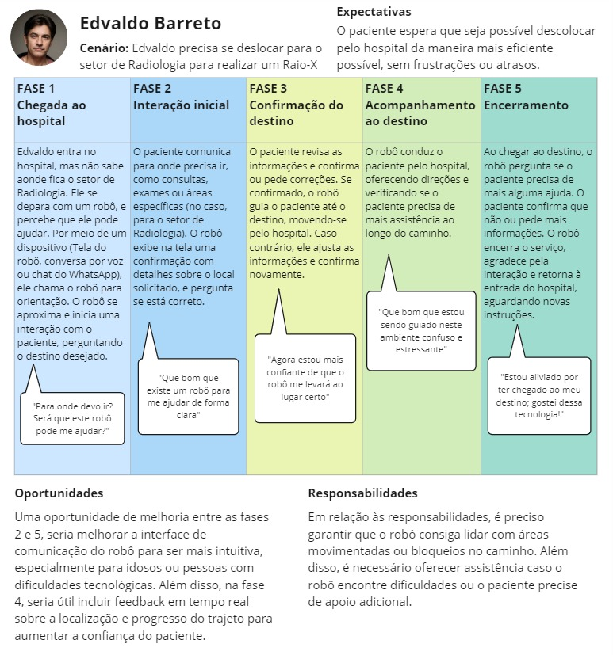

## Introdução

&emsp;&emsp;O Mapa de Jornada do Usuário é uma ferramenta visual, utilizada para capturar a sequência de interações que um usuário tem com um produto, serviço ou organização ao longo de sua experiência. Ele vai além de uma simples representação de atividades, fornecendo uma narrativa detalhada e organizada sobre as experiências, emoções, expectativas, pontos de dor e momentos de satisfação que o usuário vivencia em cada etapa do processo. 

&emsp;&emsp;Por meio desse mapa, é possível observar como os usuários interagem com diferentes touchpoints ao longo de sua jornada. Dessa forma, é possível compreender a fundo os comportamentos do usuário e, principalmente, para identificar oportunidades de melhoria e otimização na experiência oferecida.

### Mapa da Jornada do Usuário

&emsp;&emsp;No caso deste projeto em parceria com a IBM e projetado para hospitais, foi desenvolvida uma jornada do usuário para a persona Edvaldo Barreto, pois ele representa o público-alvo dos usuário da solução, e suas características são adequadas ao contexto em que a solução será inserida. Através dessa representação, foi possível identificar os principais pontos de dor, os momentos de satisfação e as oportunidades de melhoria que precisam ser priorizadas, garantindo que o projeto seja ajustado para oferecer a melhor experiência possível.

<b>Fonte:</b> Elaborado pelo Grupo 3

&emsp;&emsp;A imagem apresenta a jornada do paciente Edvaldo, que precisa se deslocar ao setor de Radiologia para realizar um Raio-X em um hospital. A jornada está dividida em cinco fases: Chegada ao Hospital, Interação Inicial, Confirmação do Destino, Acompanhamento ao Destino, e Encerramento. Cada fase contém uma breve descrição das ações do paciente e do robô. A primeira fase mostra Edvaldo solicitando a ajuda do robô por meio de um dispositivo, e o robô se aproximando para iniciar a interação. Na segunda fase, o paciente comunica seu destino e o robô exibe na tela as informações para confirmação.

&emsp;&emsp;A terceira fase foca na confirmação de detalhes, em que o paciente verifica se o destino e as informações exibidas estão corretas. Na quarta fase, o robô acompanha Edvaldo até o destino, fornecendo direções e verificando se ele precisa de mais ajuda. Por fim, a quinta fase encerra a interação, com o robô perguntando se o paciente necessita de mais alguma assistência. Ao final, o robô retorna à sua base de carregamento. O mapa também inclui as Expectativas do paciente, que é o que o Edvaldo espera em relação ao cenário, e os pontos de Oportunidades e Responsabilidades, que destacam a necessidade de melhoria na interface e suporte do robô.

## Conclusão

&emsp;&emsp;Dessa forma, a jornada do Edvaldo ao utilizar o robô guia no hospital demonstra uma utilização bem sucedida da tecnologia para a assistência ao paciente. No entanto, foram identificadas oportunidades de melhoria, especialmente em questões de acessibilidade digital e física, como a simplificação da interface do robô e sua capacidade de adaptação a diferentes perfis de usuários. Garantir que o robô seja intuitivo e acessível, além de fornecer suporte eficiente em todas as etapas, é essencial para aprimorar a experiência do paciente e alcançar uma navegação hospitalar mais eficaz.