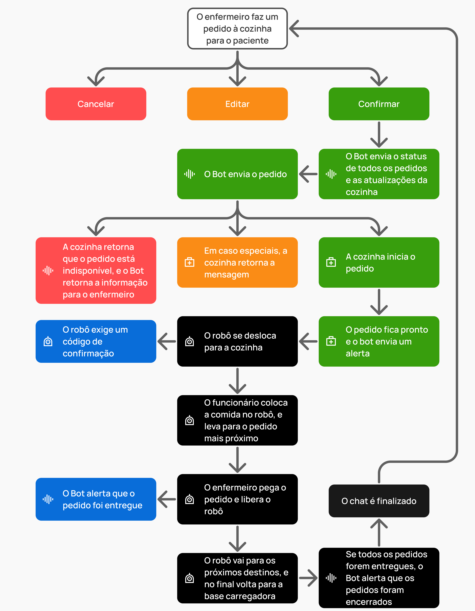

## Introdução

&emsp;&emsp;Durante a Sprint 2, o grupo iniciou o desenvolvimento de um ambiente dedicado à utilização da solução. Esta etapa tem como objetivo permitir que os usuários consigam interagir com o robô e controlá-lo conforme necessário. Com base nas user stories e personas definidas na Sprint 1, e também na mudança de escopo que ocorreu da Sprint 1 para a Sprint 2, foram identificadas algumas necessidades dos usuários e elementos que devem estar presentes na interface para garantir um bom funcionamento do sistema desenvolvido.

&emsp;&emsp;Para facilitar a visualização e o entendimento desses elementos, foi decidido criar inicialmente um fluxograma, destacando a ideia inicial do grupo de cada passo da utilização da solução, e depois uma árvore de decisão, para apresentar mais detalhes e possibilidades dessa utilização. Em seguida, foi desenvolvido o Wireframe, uma representação esquemática e simplificada da interface, destacando a estrutura, funcionalidades e disposição dos elementos. E depois, foi desenvolvido o Mockup, uma representação mais detalhada e realista da interface, incluindo aspectos visuais como cores, tipografia e imagens, proporcionando uma prévia mais próxima do produto final.

## Fluxograma

&emsp;&emsp;O fluxograma inicial da solução foi importante para destacar os passos do funcionamento do sistema, em um momento que houve uma mudança de escopo da Sprint 1 para a Sprint 2 no projeto. Esta representação não apresenta uma grande quantidade de detalhes, porém mostra uma situação das várias que podem ser beneficiadas pelo uso da solução.

<b>Fonte:</b> Elaborado pelo Grupo 3

&emsp;&emsp;A representação acima demonstra uma situação em que um paciente precisa de uma roupa nova de cama. Assim que o enfermeiro é acionado, a solução entra em ação, ao interagir com o enfermeiro por meio de uma LLM, acionar a ala de roupa de cama e enviar o robô para a ala.

&emsp;&emsp;Após chegar à ala, uma pessoa do serviço de cama coloca a roupa de cama no robô, e após digitar um código de verificação, o robô se desloca com a roupa para o quarto especificado. No quarto, o enfermeiro de lá pegará a roupa, e o robô retornará para uma base carregadora e aguardará receber um novo chamado.

## Árvore de Decisão

&emsp;&emsp;Após a criação do fluxograma acima, um outro diagrama foi criado para ilustrar com mais detalhes os elementos da solução. Dessa vez, o diagrama foi criado em um formato de árvore de decisão, em que mostra possibilidades diferentes dentro do fluxo de utilização da solução.

<b>Fonte:</b> Elaborado pelo Grupo 3

&emsp;&emsp;Esta representação mostra uma outra situação, a de um pedido do enfermeiro à cozinha, mas que ainda assim possui um fluxo semelhante à situação anterior. O enfermeiro faz o pedido por meio da LLM, presente num chat do WhatsApp, em que este Bot além de enviar o pedido ele informa ao enfermeiro o status de todos os pedidos e atualizações da cozinha.

&emsp;&emsp;Após enviar o pedido, a cozinha informará se o pedido está disponível ou não e se tem mais detalhes, e o próprio Bot alertará o enfermeiro sobre o que ocorreu. Assim, caso o pedido tenha sido iniciado e finalizado com sucesso, o robô se deslocará da cozinha até um ou mais quartos para distribuir as comidas, e quando acabar, retornará para a base carregadora.

## Wireframe

&emsp;&emsp;Para ilustrar de forma inicial como será a plataforma web da solução, foram criados wireframes, que representam as partes de logs e dashboards da solução. É importante destacar que essas informações tanto dos logs quanto das dashboards são disponíveis para o gestor hospitalar, que tem o acesso da plataforma web, e não para os enfermeiros. Logo, o gestor poderá ter acesso a mais informações, que podem agregar para planejamentos entratégicos no hospital.

<b>Fonte:</b> Elaborado pelo Grupo 3

&emsp;&emsp;Os logs mostram todo o histórico de utilização, em que exibem informações armazenadas durante a interação e utilização do robô, como data, usuário, ação, categoria, local e status. Assim, o gestor do hospital pode ter mais informações sobre os últimos processos do sistema.

<b>Fonte:</b> Elaborado pelo Grupo 3

&emsp;&emsp;A parte das dashboards ilustra gráficos da quantidade de requisições feitas por tipo de requisição, média de tempo das requisições ao longo do dia e pedidos realizados ao longo do dia x pedidos cancelados ao longo do dia, e exibe um mapa que destaca o funcionamento dos robôs, mostrando a sua localização em relação à área mapeada, e uma cor diferente para cada status diferente. Dessa forma, o gestor pode receber mais detalhes sobre os processos da solução, e fazer análises que podem agregar para a logística do hospital.

## Mockup

&emsp;&emsp;Demonstrações de como são as conversas entre o Bot do WhatsApp e o enfermeiro também foram ilustradas. Vale ressaltar que foi escolhido usar o WhatsApp como meio de comunicação com o robô, pois o grupo conversou com profissionais do Hospital Sírio Libanes, e foi abordado que o WhatsApp é um meio de comunicação importante e muito utilizado entre os profissionais do hospital, como os enfermeiros. Dessa forma, foi escolhido manter a comunicação por meio desta ferramenta, para facilitar na adaptação e usabilidade dos enfermeiros.

Como o Mockup desta interação possui uma longa extensão, apenas alguns trechos dela serão exibidos nessa documentação. Apesar disso, a sua forma completa pode ser vista no seguinte link: https://www.figma.com/design/KM3vrijyJzSp15toRTLqiD/User-Persona-Template-(Community)?node-id=1000-658&t=8ngfGLJFPXLOUSVv-1

<b>Fonte:</b> Elaborado pelo Grupo 3

&emsp;&emsp;A interação começa a partir de uma mensagem do Bot, que pede uma confirmação dos itens que serão utilizados. Após essa confirmação, o Bot anuncia que o envio já foi iniciado, e destaca esse pedido no tópico de pedidos em andamento.

<b>Fonte:</b> Elaborado pelo Grupo 3

&emsp;&emsp;Acima, é possível ver que houve o pedido de uma salada de frutas, em que logo após a confirmação a cozinha notificou que este pedido está indisponível no momento.

<b>Fonte:</b> Elaborado pelo Grupo 3

&emsp;&emsp;Quando os pedidos forem preparados, o robô fará as entregas, e caso dois pedidos fiquem prontos no mesmo momento, as entregas serão feitas por ordem de proximidade. Quando o pedido chegar aos destinos, o enfermeiro terá que utilizar a senha enviada pelo WhatsApp para confirmar a entrega pelo robô.

## Conclusão

&emsp;&emsp;Dessa forma, é possível detalhar o desenvolvimento e a estrutura da interface da solução, desde a criação inicial do fluxograma até a elaboração do mockup. Cada etapa do processo foi planejada para garantir uma experiência de usuário intuitiva e eficiente, através de representações visuais dos fluxos de trabalho e das interações esperadas, permitindo compreender melhor o funcionamento do sistema.