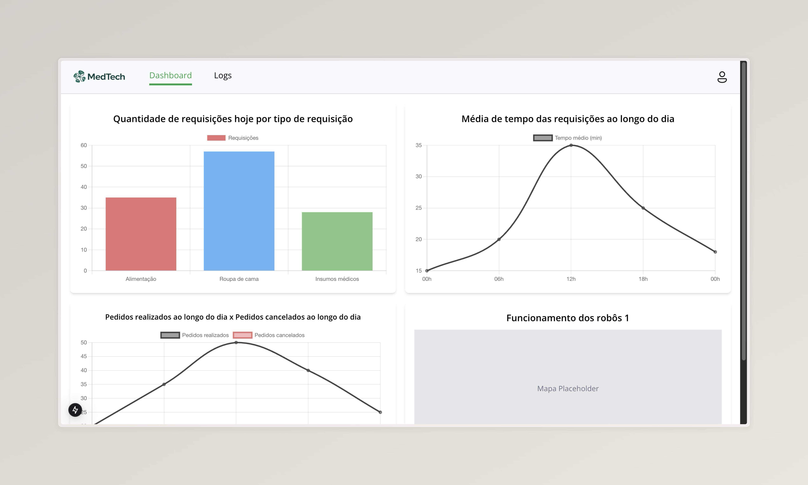

# O que é um sistema de Logs e por que utilizamos em nossa aplicação

&emsp;Um sistema de logs é uma ferramenta essencial para o monitoramento e a manutenção de qualquer aplicação. Ele registra eventos que ocorrem no sistema, permitindo rastrear ações realizadas pelos usuários, identificar falhas e monitorar o comportamento da aplicação. Em nossa aplicação, o sistema de logs desempenha um papel fundamental ao garantir a transparência das ações realizadas e fornecer insights para futuras melhorias.

## Por que utilizamos logs?

1. **Monitoramento:** Acompanhar o comportamento da aplicação em tempo real.

2. **Auditoria:** Rastrear ações realizadas por usuários e identificar responsabilidades.

3. **Análise de Desempenho:** Identificar gargalos ou padrões que possam afetar a experiência do usuário.

4. **Depuração:** Facilitar a identificação e correção de erros.

## Impementação

&emsp;Nosso sistema de logs foi projetado para registrar ações realizadas por usuários, categorizando-as por tipo e contexto. A seguir, apresentamos a implementação das principais operações do sistema.

### Código

```typescript
import { Injectable, HttpException, HttpStatus } from '@nestjs/common';
import { SupabaseService } from './supabase.service';
import { Log } from '../interfaces/log.interface';

@Injectable()
export class LogsService {
  constructor(private readonly supabaseService: SupabaseService) {}

  private getFormattedDatetime(): string {
    const now = new Date();
    return now.toLocaleString('pt-BR', { timeZone: 'America/Sao_Paulo' });
  }

  async createLog(user: string, action: string, category: string, local: string, status: string, user_id?: number) {
    const supabase = this.supabaseService.getClient();

    try {
      const logData = {
        user: user,
        action: action,
        category: category,
        local: local,
        status: status,
        date: this.getFormattedDatetime(),
        ...(user_id && { user_id: user_id }),
      };

      await supabase.from('log').insert(logData);

      return {
        status: 'success',
        message: 'Log registrado com sucesso',
      };
      
    } catch (error) {
      console.error('Erro ao registrar log:', error);
      throw new HttpException(
        `Erro ao registrar log: ${error.message}`,
        HttpStatus.INTERNAL_SERVER_ERROR,
      );
    }
  }

  async updateLogStatus(id: number, status: string): Promise<{ message: string }> {
    const supabase = this.supabaseService.getClient();
  
    try {
      const checkResponse = await supabase.from('log').select('*').eq('id', id);
  
      if (!checkResponse.data || checkResponse.data.length === 0) {
        throw new HttpException(
          'Log não encontrado para atualização',
          HttpStatus.NOT_FOUND,
        );
      }
  
      const updateResponse = await supabase
        .from('log')
        .update({ status: status })
        .eq('id', id);
  
      if (updateResponse.error) {
        console.error('Erro ao atualizar log:', updateResponse.error);
        throw new HttpException(
          `Erro ao atualizar log: ${updateResponse.error.message}`,
          HttpStatus.INTERNAL_SERVER_ERROR,
        );
      }
  
      return { message: 'Status do log atualizado com sucesso' };
  
    } catch (error) {
      console.error('Erro ao atualizar log:', error);
      throw error;  
    }
  }  

  async listLogs(): Promise<Log[]> {
    const supabase = this.supabaseService.getClient();

    try {
      const response = await supabase.from('log').select('*');

      return response.data as Log[];
    } catch (error) {
      console.error('Erro ao listar logs:', error);
      throw new HttpException(
        `Erro ao listar logs: ${error.message}`,
        HttpStatus.INTERNAL_SERVER_ERROR,
      );
    }
  }

  async getLog(id: number): Promise<Log> {
    const supabase = this.supabaseService.getClient();

    try {
      const response = await supabase.from('log').select('*').eq('id', id);

      return response.data[0];
    } catch (error) {
      console.error('Erro ao buscar log:', error);
      throw new HttpException(
        `Erro ao buscar log: ${error.message}`,
        HttpStatus.INTERNAL_SERVER_ERROR,
      );
    }
  }

  async deleteLog(id: number): Promise<{ message: string }> {
    const supabase = this.supabaseService.getClient();
  
    try {
      const checkResponse = await supabase.from('log').select('*').eq('id', id);
  
      if (!checkResponse.data || checkResponse.data.length === 0) {
        throw new HttpException(
          'Log não encontrado para exclusão',
          HttpStatus.NOT_FOUND,
        );
      }
  
      const deleteResponse = await supabase.from('log').delete().eq('id', id);
  
      if (deleteResponse.error) {
        console.error('Erro ao deletar log:', deleteResponse.error);
        throw new HttpException(
          `Erro ao deletar log: ${deleteResponse.error.message}`,
          HttpStatus.INTERNAL_SERVER_ERROR,
        );
      }
  
      return { message: 'Log deletado com sucesso' };
      
    } catch (error) {
      console.error('Erro ao deletar log:', error);
      throw error;  
    }
  }  
}
```

## Fluxo e aplicação na interface

&emsp;A implementação do sistema de logs está diretamente integrada à nossa aplicação e pode ser visualizada em duas interfaces principais: a tabela de registros de logs e o dashboard de análise.

### Registro de Logs Tabelado

&emsp;Nesta interface, os logs são exibidos em formato tabelar, contendo informações detalhadas sobre cada evento, como o usuário, a ação realizada, a data, o status, entre outros.


<b>Fonte:</b> Elaborado pelo Grupo 3

### Dashboard com Gráficos Gerados a Partir dos Logs

&emsp;Além da tabela, os dados dos logs alimentam um dashboard com gráficos que permitem a análise visual do comportamento do sistema. Isso inclui:

1. Ações mais realizadas.

2. Categorias de maior incidência.

3. Horários de maior utilização.



<b>Fonte:</b> Elaborado pelo Grupo 3

# Conclusão

&emsp;O sistema de logs implementado fornece uma base sólida para o rastreamento e a análise das ações realizadas em nossa aplicação. Ele não apenas permite a detecção de falhas de forma eficiente, mas também auxilia na tomada de decisões baseadas em dados reais. A combinação da exibição tabelada com um dashboard analítico torna este sistema um componente essencial para a gestão e evolução da aplicação.