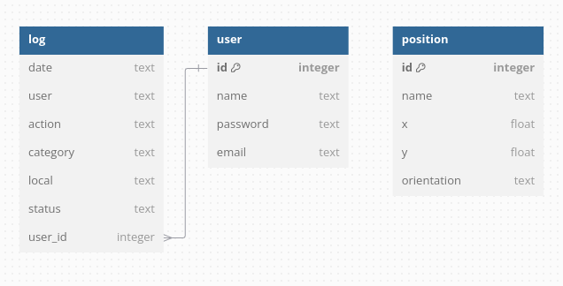

# Escolha do Serviço de Banco de Dados

&emsp;Nesta aplicação, optamos por utilizar o Supabase como nosso serviço de banco de dados. O Supabase é uma plataforma de backend como serviço (BaaS) que oferece uma solução simples, escalável e de fácil integração com aplicações modernas. Ele é gratuito para a maioria dos casos de uso iniciais, o que facilita o desenvolvimento e testes sem a necessidade de grandes investimentos. 
&emsp;Além disso, sua compatibilidade com PostgreSQL oferece uma base relacional robusta para o gerenciamento de dados.

## Relacional vs Não Relacional: Nossa Escolha

&emsp;Optamos por um banco de dados relacional para a implementação da nossa aplicação, principalmente devido à necessidade de um modelo estruturado que possibilite o rastreamento de ações de usuários de maneira eficiente e consistente.

&emsp;Os bancos de dados relacionais são ideais quando se trata de garantir integridade referencial entre as tabelas, o que é essencial para a estrutura da nossa aplicação. Neste caso, estamos utilizando um modelo em que ações dos usuários são registradas de forma organizada e facilmente consultável. A utilização de tabelas interligadas permite realizar consultas complexas e obter relatórios detalhados sobre o comportamento dos usuários ao longo do tempo.

## Estrutura do Banco de Dados

&emsp;A estrutura do banco de dados foi projetada para atender à necessidade de registrar, rastrear as ações dos usuários e armazenar a posição que o robô deve percorrer até um ponto X no hospital. Abaixo está o modelo SQL que define as tabelas e seus relacionamentos:


```sql
-- Tabela para armazenar o log de ações dos usuários
Table log {
  date text,           -- Data e hora da ação
  user text,           -- Nome ou identificador do usuário
  action text,         -- Descrição da ação realizada
  category text,       -- Categoria da ação (ex: login, atualização, etc.)
  local text,          -- Localização ou contexto da ação
  status text,         -- Status da ação (ex: sucesso, erro)
  user_id integer,     -- Chave estrangeira referenciando o usuário
}

-- Tabela de usuários
Table user {
  id integer [primary key],   -- Identificador único do usuário
  name text,                  -- Nome do usuário
  password text,              -- Senha do usuário (armazenada de forma segura)
  email text                  -- E-mail do usuário
}

-- Tabela de posições no mapa para o robô
Table position {
  id integer [primary key],  -- Identificador único da posição
  name text,                 -- Nome do ponto no mapa
  x float,                   -- Coordenada X no mapa
  y float,                   -- Coordenada Y no mapa
  orientation text           -- Orientação do robô nesse ponto
}

-- Relacionamento entre as tabelas 'log' e 'user'
Ref: log.user_id > user.id

```



<b>Fonte:</b> Elaborado pelo Grupo 3

### Descrição das Tabelas:

&emsp;Tabela `user`: Armazena informações essenciais sobre os usuários da aplicação, como o `id` (chave primária), o `nome`, o `email` e a `senha`. O campo `id` é utilizado para associar o usuário às ações registradas na tabela `log`.

&emsp;Tabela `log`: Registra as ações realizadas pelos usuários. Cada entrada inclui a data e hora da ação, o tipo de ação realizada (campo `action`), a categoria dessa ação (campo `category`), o status da ação, e uma referência ao usuário que executou a ação (`user_id`), estabelecendo uma relação com a tabela `user` por meio da chave estrangeira `user_id`.

&emsp;Tabela `position`: Armazena informações sobre os pontos no mapa para onde o robô deve se deslocar. Cada entrada contém um identificador único (`id`), o nome do ponto (`name`), suas coordenadas (`x`,`y`) e a orientação do robô (`orientation`).

## Fluxo de Dados

1. **Cadastro de Usuário:** Quando um usuário se registra na aplicação, os dados (nome, email, senha) são armazenados na tabela `user`.

2. **Registro de Ações:** Durante o uso da aplicação, as ações realizadas pelo usuário são registradas na tabela `log`. Cada ação é associada ao `user_id`, garantindo que a origem da ação possa ser rastreada de forma precisa.

3. **Consultas e Relatórios:** A estrutura relacional facilita a execução de consultas que podem agrupar e filtrar ações com base no usuário, tipo de ação, categoria, entre outros parâmetros. Isso permite a geração de relatórios detalhados sobre o comportamento dos usuários.

4. **Gestão de Posições:** O sistema utiliza os dados da tabela `position` para determinar os pontos no mapa para onde o robô deve se deslocar, permitindo uma navegação eficiente e precisa.

## Conexão com o Backend

&emsp;Abaixo está o código usado para configurar a conexão do backend da aplicação com o banco de dados no Supabase:

```typescript
import { Injectable } from '@nestjs/common';
import { createClient, SupabaseClient } from '@supabase/supabase-js';
import { ConfigService } from '@nestjs/config';

@Injectable()
export class SupabaseService {
  private readonly client: SupabaseClient;

  constructor(private readonly configService: ConfigService) {
    // Obtendo as credenciais do Supabase a partir das variáveis de ambiente
    const supabaseUrl = this.configService.get<string>('SUPABASE_URL');
    const supabaseKey = this.configService.get<string>('SUPABASE_KEY');

    if (!supabaseUrl || !supabaseKey) {
      throw new Error('Supabase URL ou chave não configurados corretamente');
    }

    // Criando o cliente do Supabase
    this.client = createClient(supabaseUrl, supabaseKey);
  }

  // Retorna o cliente do Supabase para ser usado em outras partes do código
  getClient(): SupabaseClient {
    return this.client;
  }

  // Exemplo de função para buscar todos os usuários
  async getUsers() {
    const { data, error } = await this.client.from('user').select('*');
    
    if (error) {
      console.error('Erro ao acessar a tabela user:', error);
      throw new Error(`Erro ao acessar a tabela user: ${error.message}`);
    }

    console.log('Usuários obtidos:', data);  
    return data;
  }
}
```

### Descrição do Código

1. **Configuração:** O serviço SupabaseService utiliza o pacote supabase-js para gerenciar a conexão com o Supabase. As credenciais (SUPABASE_URL e SUPABASE_KEY) são obtidas de variáveis de ambiente para maior segurança.

2. **Cliente do Supabase:** Um cliente Supabase é criado e armazenado para reutilização.

3. **Função de Exemplo:** A função getUsers() demonstra como consultar a tabela user no banco de dados, retornando todos os registros.

# Conclusão

&emsp;A escolha de um banco de dados relacional com o Supabase, juntamente com a estruturação de tabelas interligadas, oferece uma solução eficaz e escalável para o rastreamento de ações dos usuários na nossa aplicação. O uso de chaves estrangeiras e o modelo relacional nos permitem manter a integridade dos dados e realizar consultas complexas com facilidade, oferecendo uma base sólida para a aplicação crescer e se expandir no futuro.