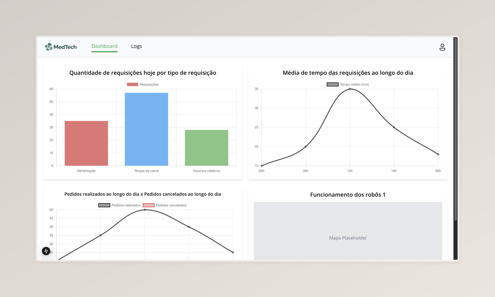
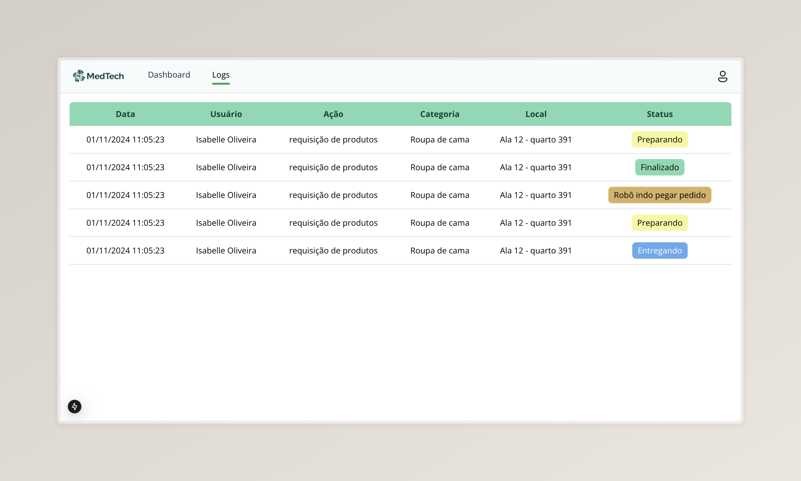

# Introdução

&emsp;Neste projeto, estamos utilizando Next.js como tecnologia principal para o desenvolvimento do Frontend. Para a estilização, optamos pelo Tailwind CSS, que facilita a criação de interfaces responsivas e modernas com uma abordagem de classe utilitária.

## Por que escolhemos essas tecnologias?

1. Next.js:

    - Permite deploy gratuito e eficiente na Vercel, simplificando o processo de colocar o projeto em produção.
    - Estrutura modular, que melhora a organização do código.
    - Possui recursos nativos para SEO e renderização híbrida (SSR e SSG), melhorando a performance e acessibilidade.

2. Tailwind CSS:

    - Facilita a criação de layouts responsivos para diferentes dispositivos.
    - Estilização diretamente no HTML com classes utilitárias, acelerando o desenvolvimento.

&emsp;Essas escolhas tornam nosso projeto mais ágil, escalável e fácil de manter.

## Telas do Sistema

&emsp;Nosso Frontend possui duas telas principais, já que o foco do serviço está na interação via WhatsApp. Essas telas servem como suporte para gerenciar e visualizar informações importantes relacionadas aos processos e usuários:

1. Dashboard: Apresenta gráficos e indicadores de desempenho das operações.
2. Tela de Logs: Exibe um registro tabelado para rastrear as ações realizadas pelos usuários.

### Dashboard

&emsp;A tela de Dashboard é o painel principal do sistema, onde os usuários podem visualizar métricas importantes de forma intuitiva. Abaixo estão os gráficos e funcionalidades disponíveis nesta tela:

1. Quantidade de Requisições por Tipo: Mostra o volume de requisições do dia atual, categorizadas por tipo.
2. Pedidos Realizados x Cancelados: Compara a quantidade de pedidos efetuados e cancelados ao longo do dia.
3. Média de Tempo das Requisições: Exibe a média de duração das requisições em diferentes horários do dia.
4. Status dos Robôs: Apresenta o estado atual dos robôs responsáveis pela execução de tarefas.

&emsp;Exemplo da Interface:

<b>Fonte:</b> Elaborado pelo Grupo 3

> Detalhes Técnicos:

&emsp;Os gráficos utilizam a biblioteca Chart.js, que permite criar visualizações interativas e responsivas. A página é protegida por uma barra de navegação (`Navbar`) que mantém o layout consistente.

### Tela de logs tabelada

&emsp;A tela de Logs é utilizada para rastrear todas as ações realizadas no sistema, proporcionando uma visão detalhada das operações. Cada registro é exibido em formato de tabela, com as seguintes colunas:

- **Data:** Data e hora do registro.
- **Usuário:** Nome do usuário responsável pela ação.
- **Ação:** Descrição do evento ou tarefa realizada.
- **Categoria:** Tipo da requisição ou ação.
- **Local:** Localização específica onde ocorreu a ação.
- **Status:** Estado atual da ação (e.g., "Preparando", "Finalizado").

&emsp;Exemplo da Interface:

<b>Fonte:</b> Elaborado pelo Grupo 3

> Funcionalidades Adicionais:

- Cores Dinâmicas: O status de cada ação é destacado com cores específicas, facilitando a identificação visual (e.g., "Preparando" em amarelo, "Finalizado" em verde).
- Responsividade: A tabela foi projetada para funcionar bem em diferentes tamanhos de tela.

# Conclusão

&emsp;O Frontend desenvolvido para este projeto é simples, mas altamente funcional, atendendo às necessidades específicas do sistema. As tecnologias escolhidas, como Next.js e Tailwind CSS, garantem uma implementação eficiente e moderna, permitindo:

- Gestão visual dos dados (gráficos e tabelas dinâmicos).
- Rastreamento eficiente das ações do sistema.
- Facilidade de manutenção e escalabilidade para futuras melhorias.

&emsp;A arquitetura modular e a integração com ferramentas como Chart.js e Vercel tornam este projeto uma base sólida para expandir funcionalidades conforme necessário.