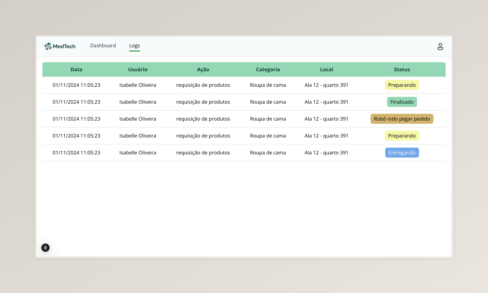

# Frontend

## Refatoração na sprint 4

&emsp;&emsp;Conforme o feedback recebido na sprint 3, foi decidido que seria necessário refatorar alguns aspectos da aplicação em relação ao frontend do projeto. O principal ponto de melhoria foi em relação à visualização dos dados, que não estava clara sobre qual intervalo de tempo estava sendo analisada e ter uma só fonte de visualização não seria produtivo ao usuário. Assim, nessa sprint, o principal foco foi implementar filtros de data e de organização da tabela, possibilitando múltiplas análises com os dados fornecidos. Além disso, para facilitar essa implementação, foi feita uma refatoração no código utilizando componentes da biblioteca `shadcn ui`, que permitiu a modularização do código e a reutilização de componentes, além de facilitar as lógicas dos filtros. A estética não foi alterada, devido ao feedback positivo da estilização, então o foco foi na usabilidade.

&emsp;&emsp;Em relação à integração com o backend, a tela com a tabela de logs foi integrada, porém, a tela de dashboard ainda não está integralmente funcional. Os dados apresentados ainda são fictícios, mas a aplicação está pronta para receber dados reais conforme o sistema é utilizado e os logs são registrados.

&emsp;&emsp;No que diz respeito aos filtros, as tabelas com informações mais gerais sobre categoria, existem as opções: Hoje, Essa Semana, Esse Mês, Esse semestre e Esse Ano. Já para as tabelas com informações mais específicas, as opções são: 00h-12h, 12h-00h e Hoje, para visualizar todos os registros do dia atual. Além disso, o gráfico de funcionamento dos robôs foi alterado de formato em mapa para lista que exibe o nome do robô e o nível de bateria. Essa mudança foi pensada a partir da implementação dessa funcionalidade, que necessitaria de mais robôs e um mapa maior do que o disponível para desenvolvimento da POC. Assim, o formato de lista permite uma visualização mais clara e objetiva dos dados com base no que o grupo já tem disponível.

## Telas

### Antes:

### Depois:

### Antes:

### Depois:

## Conclusão

&emsp;&emsp;Houve melhorias significativas na usabilidade da aplicação, com a implementação de filtros e a modularização do código. Ainda há trabalho a ser feito para integrar a tela de dashboard com o backend, mas a aplicação está pronta para receber dados reais e fornecer informações úteis para os usuários. A refatoração do código permitiu uma maior organização e reutilização de componentes, facilitando a manutenção e a adição de novas funcionalidades no futuro.