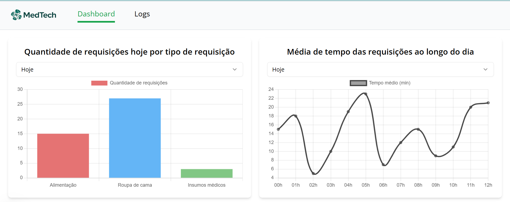
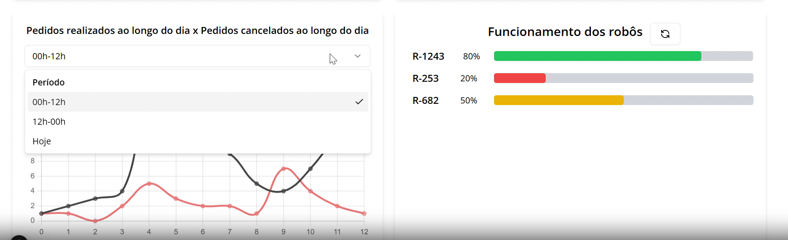
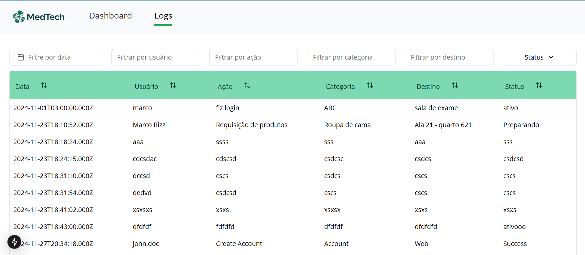

# Projeto final

## Introdução

&emsp;O grupo desenvolveu um sistema de entrega autônomo de itens de hotelaria e insumos médicos na ala de internação acionados via chatbot. Essa solução busca melhorar a experiência do paciente durante o período de internação e facilitar o cotidiano da enfermaria com diversos pedidos acerca de hotelaria e restaurante do hospital. Assim, com um chatbot do WhatsApp, a pessoa enfermeira pode fazer pedidos de refeições, solicitar roupas de camas e solicitar insumos não medicamentosos, como luvas e toucas. A prova de conceito (POC) abrange esses três itens, mas é possível expandir para a entrega de outros itens. 

&emsp;A partir desses pedidos enviados para as alas respectivas, um robô autônomo será direcionado para a ala para retirar o pedido e transportá-lo até o quarto do paciente ou área destinada. Assim, ao chegar no local, o enfermeiro retira o pedido do robô e o robô se direciona para o próximo pedido, até que todos sejam entregues. Após finalizar seu trabalho, o robô retorna para a base de carregamento.

&emsp;Essa solução tem como objetivo facilitar o cotidiano da enfermaria, trazendo mais agilidade e eficiência para os pedidos dos pacientes e enfermeiros. Além disso, o robô autônomo oferece um diferencial de agilidade e autonomia para a entrega dos pedidos, trazendo mais valor para o hospital e para a experiência do paciente, que já está em um momento delicado e precisa de atenção e cuidado.

## Arquitetura

### Funcionamento

&emsp;A arquitetura da solução é composta por três partes principais: o chatbot, o robô autônomo e o dashboard. 

- **Chatbot:** O chatbot é responsável por receber os pedidos dos enfermeiros e enviar comandos para o robô autônomo e as informações sobre o pedido para as alas de hotelaria. O chatbot é integrado com o WhatsApp, o que facilita a comunicação com os enfermeiros.

- **Robô autônomo:** O robô autônomo é responsável por retirar os pedidos e transportá-los até o quarto do paciente. O robô é controlado pelo sistema de navegação [nav2](https://docs.nav2.org/), que é responsável por planejar a rota do robô e garantir que ele chegue ao destino de forma segura e precisa. O robô é equipado com sensores de obstáculos e recalcular a rota caso encontre algum obstáculo. Para a comunicação com o chatbot, o robô possui um servidor que recebe os comandos do interpretados pela LLM e os executa.

- **Dashboard:** O dashboard é responsável por exibir as informações sobre os pedidos realizados, o status do robô e as entregas realizadas. Essa interface foi pensada para o usuário de gestão de recursos da hotelaria e facilities, de modo que forneça informações relevantes sobre a eficiência das entregas e quais produtos estão sendo mais solicitados. O dashboard é integrado com o robô autônomo e o chatbot, de modo que possa exibir informações em tempo real sobre o status das entregas e os pedidos realizados.

### Tecnologias

&emsp;A solução foi desenvolvida utilizando diversas tecnologias para garantir a integração entre os sistemas e a eficiência na entrega dos pedidos. As principais tecnologias utilizadas foram:

- **Chatbot**:
    - **Twilio:** O [Twilio](https://www.twilio.com/pt-br) é uma API que permite a integração com o WhatsApp, de modo que seja possível receber e enviar mensagens para os usuários. O Twilio é responsável por receber as mensagens dos enfermeiros e encaminhá-las para o chatbot, que irá interpretar os comandos e enviar as informações para o robô autônomo.

    - **GPT-3.5:** O [GPT-3.5](https://platform.openai.com/docs/models#gpt-3-5-turbo) é um modelo de linguagem natural (LLM) desenvolvido pela OpenAI que permite a interação com o chatbot de forma mais natural e é capaz de compreender comandos mais complexos, como a intenção do usuário e a ação a ser realizada. O GPT-3.5 é responsável por interpretar os comandos dos enfermeiros e gerar as respostas apropriadas, de modo que o robô autônomo possa realizar as entregas de forma eficiente.

    - **Nest.js**: O [Nest.js](https://nestjs.com/) é um framework de desenvolvimento de aplicações Node.js que permite a criação de APIs RESTful de forma eficiente e organizada. O Nest.js foi utilizado para criar o backend do chatbot, de modo que seja possível receber as mensagens dos enfermeiros, interpretar os comandos e enviar as informações para o robô autônomo.

- **Robô autônomo**:
    - **ROS 2:** O [ROS 2](https://docs.ros.org/en/humble/index.html) é um framework de robótica que permite a comunicação entre os diversos componentes do robô, como sensores, atuadores e sistemas de navegação. O ROS 2 é responsável por garantir a comunicação entre o chatbot e o robô autônomo, de modo que os comandos sejam interpretados corretamente e as entregas sejam realizadas de forma eficiente.

    - **Nav2:** O [Nav2](https://docs.nav2.org/) é um sistema de navegação autônoma que permite ao robô planejar a rota até o destino e garantir que ele chegue de forma segura e precisa. O Nav2 é responsável por calcular a rota do robô, evitar obstáculos e recalcular a rota caso encontre algum obstáculo no caminho. O Nav2 é integrado com a LLM, de modo que possa receber os comandos para quais locais o robô deve se locomover.

- **Dashboard**:
    - **Next.js:** O [Next.js](https://nextjs.org/) é um framework de desenvolvimento web que permite a criação de aplicações web de forma eficiente e organizada. O Next.js foi utilizado para criar o frontend do dashboard, de modo que seja possível exibir as informações sobre os pedidos realizados, o status do robô e as entregas realizadas. O Next.js é integrado com o robô autônomo e o chatbot, de modo que possa exibir informações em tempo real sobre o status das entregas e os pedidos realizados.

Para mais detalhes sobre a arquitetura, acesse a [documentação.](/arch) 

## Requisitos Funcionais

&emsp;Os requisitos funcionais da solução foram definidos com base nas necessidades dos usuários e nas funcionalidades que seriam mais úteis para os enfermeiros e pacientes. Os principais requisitos funcionais da solução estão definidos [aqui.](requisitos-funcionais)

## Negócios

&emsp;A solução desenvolvida tem como objetivo principal facilitar o cotidiano da enfermaria, trazendo mais agilidade e eficiência para os pedidos dos pacientes e enfermeiros. Além disso, o robô autônomo oferece um diferencial de agilidade e autonomia para a entrega dos pedidos, trazendo mais valor para o hospital e para a experiência do paciente, que já está em um momento delicado e precisa de atenção e cuidado. Para mais detalhes sobre a perspectiva de negócios sobre o projeto, acesse [aqui.](category/negócios)

## Entendimento do Usuário

&emsp;Para compreender as dores e necessidades do tipo de usuário que irá interagir coma  solução, foi feita uma análise da experiência do usuário, de modo a identificar os principais pontos de melhoria e as funcionalidades que seriam mais úteis para os enfermeiros e pacientes. Além disso, foram elencadas [personas](/personas) e (jornadas do usuário)[/jornada] para garantir que a solução atenda às necessidades dos usuários de forma eficiente e eficaz. Para mais detalhes sobre o entendimento do usuário, acesse [aqui.](category/experiência-com-o-usuário)

## Interface

&emsp;A interface da solução é composta por duas partes principais: o chatbot no Whatsapp, no qual o enfermeiro realiza os pedidos, e o dashboard, que exibe as informações sobre os pedidos realizados, o status do robô e as dados sobre os pedidos.

### Chatbot
Segue um vídeo de exemplo de uma conversa com o chatbot, de modo a exemplificar o funcionamento da solução:

Como exemplificado acima, a interação com o bot pode ser feita através de uma solicitação e o bot responderá com uma mensagem de confirmação com três opções de escolha: confirmar o pedido, alterar ou cancelar. Assim, o bot vai interagindo com o usuário até que o pedido seja finalizado.

### Dashboard
A interface de dashboard foi pensada no usuário que controla os pedidos e as entregas, de modo que possa visualizar as informações de forma clara e objetiva. O dashboard exibe as informações sobre os pedidos realizados, como média de tempo, número de tipos de pedidos e o nível de bateria dos robôs em funcionamento. Já a tela de logs permite ver mais detalhes sobre os pedidos, como status do pedido, quem realizou, e o tipo de pedido.

Seguem as telas do dashboard:

#### Dashboard

#### Logs

Para mais detalhes sobre a interface, acesse a a documentação das sprints anteriores.

## Desenvolvimento

Para entender melhor sobre a cada etapa do desenvolvimento, é possível acessar a documentação de cada sprint e entender o que mudou a cada duas semanas.

- [Sprint 1](category/sprint-1)
- [Sprint 2](category/sprint-2)
- [Sprint 3](category/sprint-3)
- [Sprint 4](category/sprint-4)
- [Sprint 5](category/sprint-5)

## Próximos passos

&emsp;A solução desenvolvida é uma prova de conceito (POC) que abrange os principais aspectos do sistema de entrega autônomo de itens de hotelaria e insumos médicos na ala de internação acionados via chatbot. No entanto, existem diversos aspectos que podem ser aprimorados e expandidos para garantir uma solução mais robusta e eficiente. Alguns dos próximos passos para a evolução da solução são:

- **Estudo de mercado:** Realizar um estudo de mercado para identificar possíveis concorrentes e oportunidades de expansão da solução para outros hospitais e instituições de saúde.

- **Implementação de um sistema de feedback:** Implementar um sistema de feedback para coletar informações dos usuários sobre a eficácia e usabilidade da solução, de modo a refinar e aprimorar a experiência do usuário.

- **Integração com o sistema de gestão hospitalar:** Integrar a solução com o sistema de gestão hospitalar para garantir a sincronização dos pedidos e a eficiência na entrega dos itens.

- **Testes em ambiente hospitalar real:** Realizar testes em um ambiente hospitalar real para validar a eficácia e usabilidade da solução em situações reais.

- **Expansão da solução para outros tipos de pedidos:** Expandir a solução para a entrega de outros tipos de pedidos, como medicamentos e insumos médicos, de modo a abranger um maior número de necessidades dos pacientes e enfermeiros.

## Conclusão

&emsp;A solução desenvolvida é uma prova de conceito (POC) que abrange os principais aspectos do sistema de entrega autônomo de itens de hotelaria e alimentos na ala de internação acionados via chatbot. A solução tem como objetivo principal facilitar o cotidiano da enfermaria, trazendo mais agilidade e eficiência para os pedidos dos pacientes e enfermeiros. Além disso, o robô autônomo oferece um diferencial de agilidade e autonomia para a entrega dos pedidos, trazendo mais valor para o hospital e para a experiência do paciente, que já está em um momento delicado e precisa de atenção e cuidado. Caso tenha interesse em saber mais sobre o projeto ou tirar dúvidas, entre em contato [conosco.](/#membros)